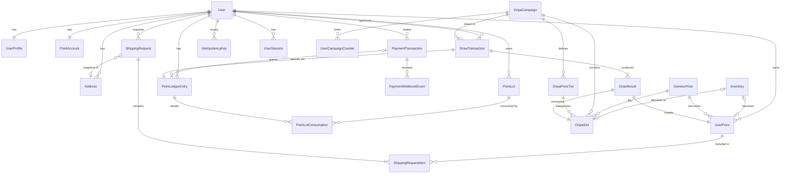

# ER 図

`prisma/schema.prisma` が正。この図は全体像の把握用。

---

## 1. 全体像



---

## 2. 3 つの主要な流れ

```
【購入】
  PaymentTransaction ──SUCCEEDED──▶ PointLot(PAID)
                                  + PointLedgerEntry(PURCHASE)
        ▲ (provider, provider_payment_id) UNIQUE
        └ PaymentWebhookEvent (provider, event_id) UNIQUE で重複排除

【抽選】
  DrawTransaction ─┬─▶ PointLedgerEntry(DRAW, 負値) ─▶ PointLotConsumption[]
                   └─▶ DrawResult[] ─▶ OripaSlot(DRAWN)
                                    ─▶ Inventory(WON)
                                    ─▶ UserPrize(UNDECIDED)

【選択】
  UserPrize ─┬─ EXCHANGED          ─▶ PointLot(FREE) + PointLedgerEntry(PRIZE_EXCHANGE)
             │                      ─▶ Inventory(EXCHANGED)
             └─ SHIPPING_REQUESTED ─▶ ShippingRequestItem ─▶ ShippingRequest
                                    ─▶ Inventory(SHIPPED)
```

---

## 3. 状態遷移

### ユーザー

```
ACTIVE ──停止──▶ SUSPENDED ──解除──▶ ACTIVE
   └──退会──▶ WITHDRAWN（論理削除。台帳・履歴は残す）
```

### オリパ

```
DRAFT ──▶ SCHEDULED ──▶ ACTIVE ──┬──▶ SOLD_OUT ──▶ ENDED ──▶ ARCHIVED
  ▲                      │       └──▶ ENDED（期間終了）
  └─ 編集可能はここだけ   └──▶ SUSPENDED ──▶ ACTIVE（再開）

ACTIVE 以降は価格・総口数・景品スロット・当選確率を変更できない。
```

### 抽選スロット

```
AVAILABLE ──抽選──▶ DRAWN
    └──運用上の取消──▶ CANCELLED
（RESERVED は将来の「確保してから確定」方式のために予約。MVP では使わない）
```

### 当選商品

```
                 ┌──交換──▶ EXCHANGED（原則取消不可）
UNDECIDED ───────┤
                 └──発送申請──▶ SHIPPING_REQUESTED ──▶ SHIPPED
                                      └──申請取消──▶ UNDECIDED
```

### 発送申請

```
REQUESTED ──▶ CHECKING ──▶ PACKING ──▶ SHIPPED ──▶ DELIVERED
     └────────────┴───────────┴──▶ CANCELLED（理由必須）
```

### 在庫

```
AVAILABLE ──オリパへ割当──▶ ALLOCATED ──当選──▶ WON
                                                 ├──▶ SHIPPING_REQUESTED ──▶ SHIPPED
                                                 └──▶ EXCHANGED
AVAILABLE / ALLOCATED ──▶ DAMAGED / LOST（理由必須）
```

---

## 4. 重要な制約一覧

| テーブル                 | 制約                                                              | 目的                            |
| ------------------------ | ----------------------------------------------------------------- | ------------------------------- |
| `users`                  | `email` UNIQUE、`email = lower(email)` CHECK                      | 重複アカウント防止              |
| `point_accounts`         | `paid_balance >= 0 AND free_balance >= 0`                         | 残高のマイナス防止              |
| `point_lots`             | `0 <= amount_remaining <= amount_issued`                          | ロット残高の破綻防止            |
| `point_ledger_entries`   | `(source_type, source_id, tx_type)` UNIQUE                        | 決済の二重付与防止（INV-9）     |
| `point_ledger_entries`   | `amount <> 0`                                                     | 無意味な記帳の排除              |
| `point_ledger_entries`   | ADJUSTMENT / REVERSAL は理由必須                                  | 監査可能性                      |
| `payment_transactions`   | `(provider, provider_payment_id)` UNIQUE                          | 決済の重複作成防止              |
| `payment_webhook_events` | `(provider, event_id)` UNIQUE                                     | Webhook の重複排除              |
| `oripa_slots`            | `inventory_id` UNIQUE（グローバル）                               | 物理在庫の重複割当防止（INV-5） |
| `oripa_slots`            | `num_nonnulls(inventory_id, generic_prize_id) = 1`                | 景品ソースの排他                |
| `oripa_slots`            | `(campaign_id, slot_number)` / `(campaign_id, draw_order)` UNIQUE | 順序の一意性                    |
| `oripa_slots`            | DRAWN なら drawn_by / drawn_at 必須                               | INV-6                           |
| `draw_transactions`      | `total_price_points = unit_price_points * draw_count`             | 価格改ざん検知                  |
| `draw_results`           | `slot_id` UNIQUE                                                  | 同一スロットの二重当選防止      |
| `user_prizes`            | `draw_result_id` / `inventory_id` UNIQUE                          | 当選と商品の 1:1                |
| `user_prizes`            | EXCHANGED なら交換日時・記帳 ID 必須                              | 交換の追跡可能性                |
| `shipping_request_items` | `user_prize_id` 部分 UNIQUE（`cancelled_at IS NULL`）             | INV-7                           |
| `idempotency_keys`       | `(user_id, scope, key)` UNIQUE                                    | INV-8                           |
| `addresses`              | 既定住所は 1 件まで（部分 UNIQUE）                                | データの一貫性                  |

CHECK 制約・部分 UNIQUE インデックス・追記専用トリガの実体は
`prisma/migrations/20260922000002_guards/migration.sql` にある。

---

## 5. 削除ポリシー

| 分類                                 | テーブル                                                                                            | 方針                            |
| ------------------------------------ | --------------------------------------------------------------------------------------------------- | ------------------------------- |
| 追記専用（`deletedAt` すら持たない） | `point_ledger_entries`, `point_lot_consumptions`, `draw_transactions`, `draw_results`, `audit_logs` | トリガで UPDATE / DELETE を拒否 |
| 論理削除                             | `users`, `addresses`, `inventories`, `oripa_campaigns`                                              | `deletedAt` を設定              |
| 状態で管理                           | `user_prizes`, `shipping_requests`, `oripa_slots`                                                   | `status` 遷移のみ               |
| 物理削除可                           | `idempotency_keys`（期限切れ）, `user_sessions`（期限切れ）                                         | 定期的に掃除                    |
